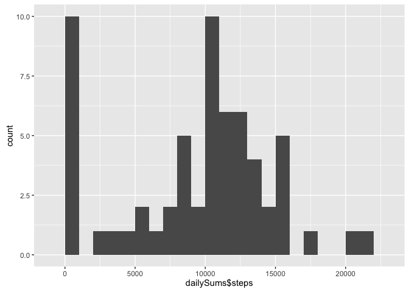
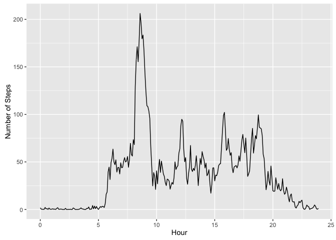
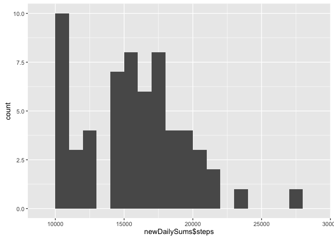
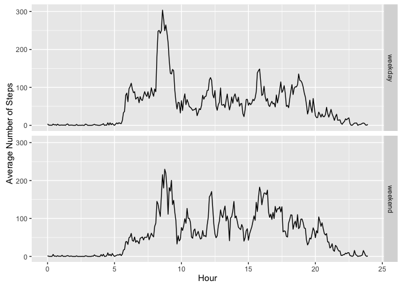

# Reproducible Research: Peer Assessment 1

Intro
This is an investigation of a personal monitoring device that counts the number of steps a certain individual takes. The data may be retrieved [here](https://d396qusza40orc.cloudfront.net/repdata%2Fdata%2Factivity.zip).

###Packages###
The following code uses the following packages:

* dplyr
* readr
* lubridate
* ggplot2

## Loading and preprocessing the data
Step 1 is loading the data that we need. The below requires the `readr` package, which in this case is convenient since it automatically formats dates and other numbers upon load. It will not automatically format the time, but that can be added as a POSIXct type using `lubridate`. The code is as follows:


```r
library(dplyr, warn.conflicts = FALSE)
activityData <- readr::read_csv('activity.csv') %>%
  mutate(datetime = lubridate::ymd_hm(paste(date, sprintf('%04d', interval))))
```

While opting to remove rows with `NA` steps is an option, it is unclear how impactful the `NA` values may be-- so for now, they are left in. This section does not contain any output.

## What is mean total number of steps taken per day?
This question might best be answered in 2 ways:

* graphically, by plotting the sum of steps by days
* the mean

This can be accomplished using the `dplyr` package, first using a `group_by` statement, then a `summarise`.

```r
library(ggplot2, warn.conflicts = FALSE)
dailySums <- group_by(activityData, date) %>%
  summarise(steps = sum(steps, na.rm = TRUE))
ggplot(data = dailySums, aes(dailySums$steps)) + geom_histogram(binwidth = 1000)
```



```r
mean(dailySums$steps)
```

```
## [1] 9354.23
```

There are 9354 steps per day, on average. This distribution looks significantly skewed looking at the histogram, as there are a few days with no recorded steps (some data are missing). The median here is 10395 steps per day. 
  

## What is the average daily activity pattern?
Just as above using `dplyr`, instead of grouping by days, we can group by times to establish a diurnal pattern.

The code and graph are shown below.


```r
dailyPattern <- activityData %>%
  mutate(Hr = lubridate::hour(datetime),
         Min = lubridate::minute(datetime),
         HrDec = Hr + Min / 60) %>%
  group_by(HrDec) %>%
  summarise(steps = mean(steps, na.rm = TRUE))
ggplot(dailyPattern, aes(x = HrDec, y = steps)) + geom_line() +
  xlab('Hour') +
  ylab('Number of Steps')
```



```r
theMax <- dailyPattern[which.max(dailyPattern$steps), ]
```

The above code may be modified to group by the `HrDec` column, which has minutes converted into fractions of hours. The maximum number of steps was about 206, which happened at 8:35.

## Imputing missing values

Missing values can get filled in with their averages, as computed by the above code chunk. The downside is that we lose specificity if there are other indicator variables other than time; however, for our purposes here, it should be sufficient.


```r
missingDatetime <- activityData[is.na(activityData$steps), 'datetime']
dailyPattern <- activityData %>%
  mutate(Hr = lubridate::hour(datetime),
         Min = lubridate::minute(datetime),
         HrDec = Hr + Min / 60) %>%
  group_by(HrDec) %>%
  summarise(meanSteps = mean(steps, na.rm = TRUE))
activityData <- activityData %>%
  mutate(HrDec = lubridate::hour(datetime) + lubridate::minute(datetime) / 60) %>%
  left_join(dailyPattern, by = 'HrDec') %>%
  mutate(stepsFilled = ifelse((is.na(steps) | steps == 0), meanSteps, steps))
countMissing <- activityData %>%
  filter(is.na(steps)) %>%
  nrow
```
There were 2304 missing rows here. Now to make a histogram of filled-in values:

```r
newDailySums <- group_by(activityData, date) %>%
  summarise(steps = sum(stepsFilled))
ggplot(data = dailySums, aes(newDailySums$steps)) + geom_histogram(binwidth = 1000)
```



```r
mean(newDailySums$steps)
```

```
## [1] 15875.99
```

```r
median(newDailySums$steps)
```

```
## [1] 15837.74
```

## Are there differences in activity patterns between weekdays and weekends?

To tackle this, we will first need to know which dates are weekends and which are weekdays.


```r
activityData <- activityData %>%
  mutate(WeekdayStr = weekdays(datetime),
         weekday = factor(ifelse(WeekdayStr == 'Saturday' | WeekdayStr == 'Sunday', 'weekend', 'weekday')))
weekday_weekend_averages <- activityData %>%
  mutate(Hr = lubridate::hour(datetime),
         Min = lubridate::minute(datetime),
         HrDec = Hr + Min / 60) %>%
  group_by(HrDec, weekday) %>%
  summarise(steps = mean(stepsFilled))
ggplot(weekday_weekend_averages, aes(x = HrDec, y = steps)) +
  geom_line() +
  facet_grid(weekday ~ .) +
  xlab('Hour') + ylab('Average Number of Steps')
```


The 9:00 AM hour has the peak in weekends and weekdays, but on weekends, the subject takes much fewer steps after that hour. On weekends, the 9:00 AM peak is lower, closer to 150, but the rest of the day sees much higher overall activity.
